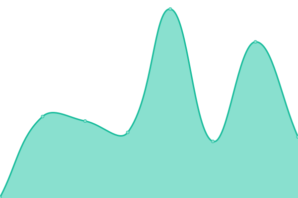

# [📈 Live Status](https://akshadagrawal.github.io/uptime-test): <!--live status--> **🟧 Partial outage**

This repository contains the open-source uptime monitor and status page for [Akshad Agrawal](https://akshadagrawal.github.io/uptime-test), powered by [Upptime](https://github.com/upptime/upptime).

With [Upptime](https://upptime.js.org), you can get your own unlimited and free uptime monitor and status page, powered entirely by a GitHub repository. We use [Issues](https://github.com/akshadagrawal/uptime-test/issues) as incident reports, [Actions](https://github.com/akshadagrawal/uptime-test/actions) as uptime monitors, and [Pages](https://akshadagrawal.github.io/uptime-test) for the status page.

<!--start: status pages-->
<!-- This summary is generated by Upptime (https://github.com/upptime/upptime) -->
<!-- Do not edit this manually, your changes will be overwritten -->
<!-- prettier-ignore -->
| URL | Status | History | Response Time | Uptime |
| --- | ------ | ------- | ------------- | ------ |
|  [Databahn dev](https://app.dev.databahn.app) | 🟩 Up | [databahn-dev.yml](https://github.com/akshadagrawal/github-uptime-1/commits/HEAD/history/databahn-dev.yml) | 

 1700ms
     
 | 

<a href="https://akshadagrawal.github.io/github-uptime-1/history/databahn-dev">99.88%</a>
    

|  [Databahn poc](https://app.poc.databahn.app) | 🟥 Down | [databahn-poc.yml](https://github.com/akshadagrawal/github-uptime-1/commits/HEAD/history/databahn-poc.yml) | 

 0ms
     
 | 

<a href="https://akshadagrawal.github.io/github-uptime-1/history/databahn-poc">0.00%</a>
    

|  [Databahn demo](https://app.cboe.databahn.fyi) | 🟥 Down | [databahn-demo.yml](https://github.com/akshadagrawal/github-uptime-1/commits/HEAD/history/databahn-demo.yml) | 

 0ms
     
 | 

<a href="https://akshadagrawal.github.io/github-uptime-1/history/databahn-demo">0.00%</a>
    

<!--end: status pages-->

[**Visit our status website →**](https://akshadagrawal.github.io/uptime-test)

## 📄 License

- Powered by: [Upptime](https://github.com/upptime/upptime)
- Code: [MIT](./LICENSE) © [Akshad Agrawal](https://akshadagrawal.github.io/uptime-test)
- Data in the `./history` directory: [Open Database License](https://opendatacommons.org/licenses/odbl/1-0/)
